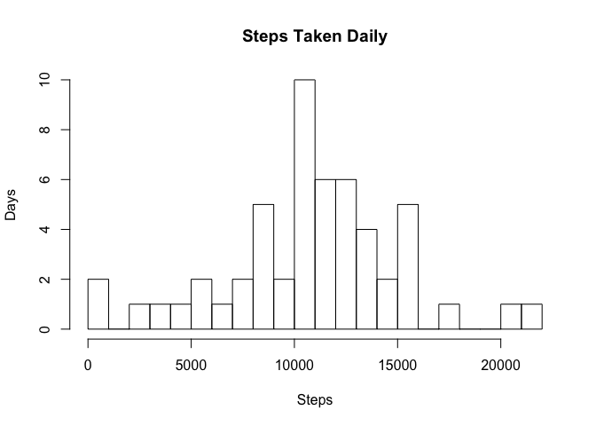
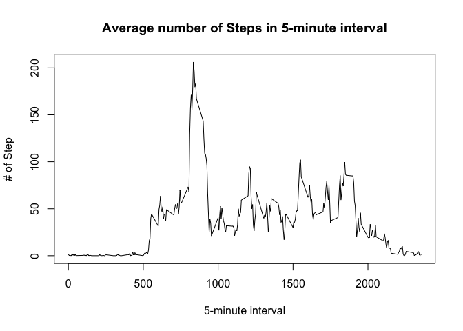
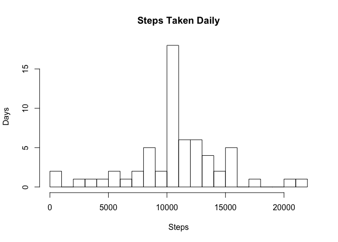

# Reproducible Research: Peer Assessment 1


## Loading and preprocessing the data

```r
fileName <- "activity.csv"
unzip("repdata-data-activity.zip", fileName)
data <- read.csv(fileName, na.strings = "NA", header=TRUE)
```


## What is mean total number of steps taken per day?

```r
dailyTotalsOfSteps <- aggregate(steps ~ date,data,sum)$steps
hist(dailyTotalsOfSteps, breaks = 16, xlab="Steps", ylab="Days", main="Steps Taken Daily")
```

 

```r
mean(dailyTotalsOfSteps)
```

```
## [1] 10766.19
```

```r
median(dailyTotalsOfSteps)
```

```
## [1] 10765
```


## What is the average daily activity pattern?

```r
meanStepsPerInterval <- aggregate(steps ~ interval,data,mean)
plot(meanStepsPerInterval$interval, 
     meanStepsPerInterval$steps, 
     type="l",
     xlab="5-minute interval",
     ylab="# of Step",
     main="Average number of Steps in 5-minute interval")
```

 
Highest Average Interval

```r
subset(meanStepsPerInterval, meanStepsPerInterval$steps == max(meanStepsPerInterval$steps))$interval
```

```
## [1] 835
```

## Imputing missing values

```r
missingRecordsCount <- sum(!complete.cases(data))
totalRecordCount <- dim(data)[1]
paste("There are ", missingRecordsCount , " missing records out of ", totalRecordCount , ", which composes ", format(missingRecordsCount / totalRecordCount*100, digits=2) ,"% of the data", sep="")
```

```
## [1] "There are 2304 missing records out of 17568, which composes 13% of the data"
```
Imputting the data

The code will compute the average for each interval and replace missing data with the average value.

```r
imputedData <- data.frame(steps=data$steps, interval=data$interval, date=data$date)
imputedData$steps[is.na(imputedData$steps)] <- with(imputedData, ave(steps, interval, FUN = function(x) mean(x, na.rm = T)))[is.na(imputedData$steps)]
```

Calculate the mean and the median

```r
dailyTotalImputedSteps <- aggregate(steps ~ date,imputedData,sum)$steps
mean(dailyTotalImputedSteps)
```

```
## [1] 10766.19
```

```r
median(dailyTotalImputedSteps)
```

```
## [1] 10766.19
```

Here's a histogram of the data after adding the imputted values

```r
hist(dailyTotalImputedSteps, 
     breaks = 16,  
     xlab="Steps", 
     ylab="Days", 
     main="Steps Taken Daily")
```

 

## Are there differences in activity patterns between weekdays and weekends?

Create a new column called weekdays

```r
data$weekdays <- sapply(as.Date(data$date), FUN = function(date) {
  dayOfWeek <- weekdays(date)
  if(dayOfWeek == "Saturday" || dayOfWeek == "Sunday") {
    as.factor("weekend")
  } else {
    as.factor("weekday")
  }
})
```

This is a panel plot comparing the average number of steps taken per 5-minute interval across weekdays and weekends

```r
library(lattice)
xyplot(steps ~ interval | weekdays, 
       data = aggregate(steps ~ interval + weekdays,data,mean), 
       layout = c(1,2), type="l",
       xlab="Interval",
       ylab="Number of steps")
```

 
